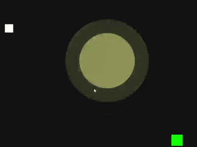
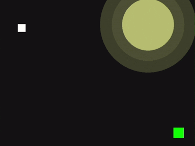

# Shadow_Chase_pygame
Shadow Chase is a stealth-based mini-game built with Python and Pygame, where you must navigate through the dark and avoid flickering searchlights to reach the exit. Get caught in the light, and it's game over.
Gameplay

1.Move using WASD keys.
2.Avoid the randomly moving flickering light.
3.The light pauses randomly like a searchlight on patrol.
4.Reach the green exit zone to win.
5.Sound effects trigger when caught or when escaping.

How to Run
Make sure you have Python and Pygame installed:

"pip install pygame"

Then run:
"python shadow_chase.py"
Place caught.wav and pass.wav sound files in the same directory.

